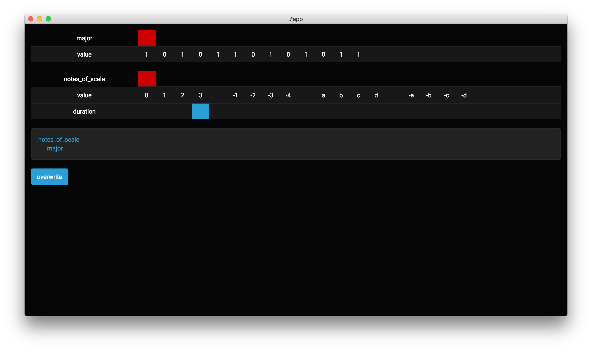

What is this?
-------------

1. A MIDI sequencer
2. A virtual instrument based on monad transformations on sequences of values
3. A musical instrument for people who love spreadsheets

To-do
-----

A very long list, but we'll get there.

References
----------

* [Web MIDI](https://www.keithmcmillen.com/blog/making-music-in-the-browser-web-midi-api/)
* [React]()
* [Redux]()
* [ImmutableJS]()
* [Electron]() via [electron-boilerplate]()
* [ES6]() via [Babel]()
* [WebMidi](https://github.com/cotejp/webmidi)
* [MIDI](https://www.midi.org/specifications/item/table-2-expanded-messages-list-status-bytes)

Screenshots
-----------

Blah blah blah
--------------

* A
  * Either[NameOfMatrix, A]
  * Optional[B]
  * Optional[C]

* B
  * (A, parameters) => A

    0. identity (default)
       * none
    1. tempo
       * multiplier: fraction
    2. transpose
       * offset: int
    3. loop
       * times: int
    4. this then that
       * m: M
    5. this with that
       * m: M
    6. apply scale
       * m: M
    7. go sub
       * m: M
    8. fork
       * m: M
    9. abc
       * abc: M
       * scale: M

* C
  * Optional[(MidiDevice, MidiChannel)]

